<div align="center">


<br />

# 트루소스 TrueSource

**답만 주지 않고, 근거와 신뢰도까지 보여주는 사내 엑셀 AI 에이전트.**

사내 엑셀 데이터에 질문하고, 남이 준 숫자나 외부 AI의 답을 쓰기 전에 검증합니다.<br />
원본은 사내 PC에 남고, 외부 LLM은 판단만 맡습니다.

<br />


**경남 AI·SW 경진대회 참가 프로젝트**

[프로젝트 소개](#프로젝트-소개) · [주요 화면](#주요-화면) · [핵심 기능](#핵심-기능) · [기술 구조](#기술-구조) · [시연 시나리오](#시연-시나리오) · [개발 환경](#개발-환경)

</div>

## 프로젝트 소개

“보고서에 영업2팀이 3위라던데 맞아요? 엑셀이 파일마다 달라서 어느 숫자를 믿어야 할지 모르겠어요.”

트루소스는 중소기업 실무자가 공유폴더에 흩어진 엑셀(부서별·연도별, `_최종`, `_최종_수정`, 복사본…)을 다루며 겪는 질문에서 출발했습니다.
질문하면 에이전트가 **어느 파일의 몇 행을 근거로 계산했는지**와 **다른 파일로 다시 확인한 결과**를 함께 보여 주고, 숫자가 서로 다르면 **두 기준을 모두 제시하고 원인까지 추적**합니다.
믿어도 되는 정도는 AI의 “확신해요”가 아니라 코드가 정한 **규칙으로 판정**하고, 낮으면 “왜 낮은지, 무엇을 확인할지”를 알려 줍니다.

| 질문하기 | 확인하기 | 찾아가기 |
| :--- | :--- | :--- |
| “3분기 실적 3등이 무슨 팀이야?” — 회의·보고 전에 숫자가 필요할 때 | “보고서에 영업2팀이 3위라던데 맞아?” — 남이 준 숫자나 외부 AI 답을 쓰기 전 | “대성기계 관련 자료 찾아줘” — 내용은 아는데 어느 파일인지 모를 때 |

### 설계 원칙

| 원칙 | 의미 | 지키는 방법 |
| :--- | :--- | :--- |
| **LLM은 판단, 코드는 판정** | 무엇을 확인할지는 LLM이, 무엇이 사실인지는 코드가 정한다 | 계산·출처·신뢰도는 코드만 생성하고, 답변 속 숫자는 코드가 다시 대조 |
| **원본은 밖으로 안 나간다** | 외부 LLM에는 질문·스키마·집계값만 전송 | 모든 LLM 호출이 보안 게이트웨이 단일 함수를 통과, 이름은 `{팀1}`로 마스킹 |
| **신뢰도는 규칙으로** | LLM의 “확신해요”를 쓰지 않는다 | 52개 규칙이 데이터 상태를 점검해 등급·이유·확인할 것을 생성 |

## 주요 화면

<table>
  <tr>
    <th align="center">시작 · 사용자 정보와 공유폴더</th>
    <th align="center">자료를 찾는 중 (입체 로딩)</th>
  </tr>
  <tr>
    <td align="center">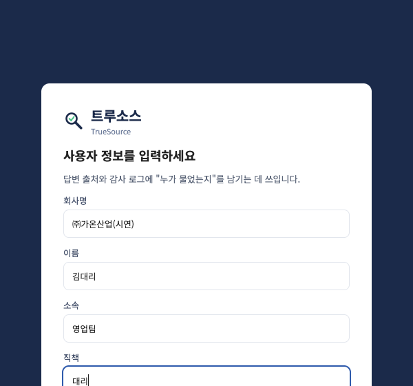</td>
    <td align="center"></td>
  </tr>
  <tr>
    <td align="center">회사 정보를 받고 공유폴더 경로를 입력하면 분석을 시작</td>
    <td align="center">질문·검색 중 입체 아이콘이 회전하고 경과 시간과 대기 상태를 표시</td>
  </tr>
</table>

### 질문하면 — 두 기준을 병기하고 원인까지

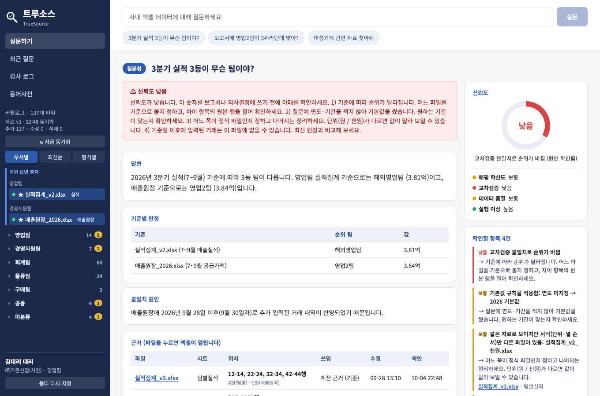

집계 파일(`실적집계_v2`)은 해외영업팀, 매출원장은 영업2팀이 3위입니다. 9/28 이후 입력된 거래가 집계 파일에 반영되지 않은 것이 원인이고, 신뢰도는 **낮음**이며 오른쪽에 **확인할 항목**이 나옵니다.

<table>
  <tr>
    <th align="center">검증형</th>
    <th align="center">찾기형</th>
  </tr>
  <tr>
    <td align="center">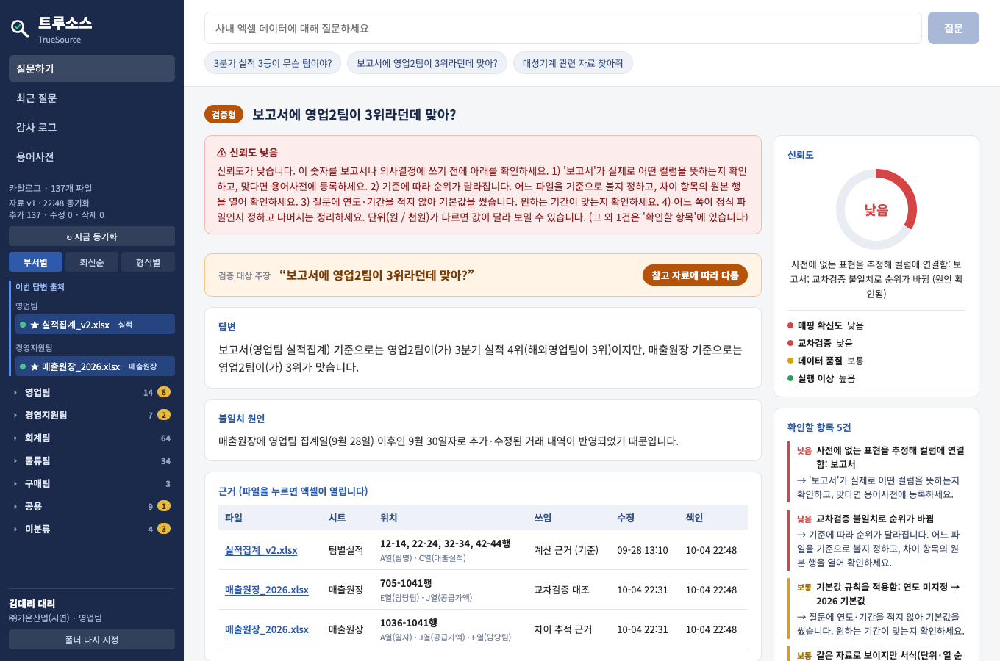</td>
    <td align="center">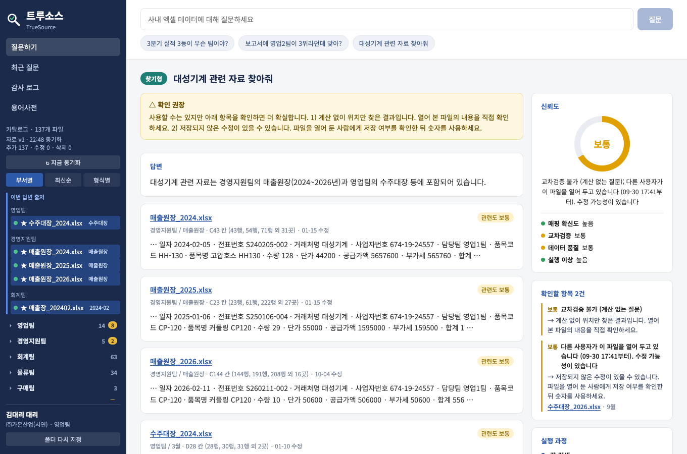</td>
  </tr>
  <tr>
    <td align="center">주장을 기준별로 확인해 맞는지·어느 기준에서 틀린지 판정</td>
    <td align="center">값이 있는 파일·시트·칸·행을 보여 주고, 편집 중인 파일은 경고</td>
  </tr>
  <tr>
    <th align="center">내용 없음</th>
    <th align="center">범위 밖 질문</th>
  </tr>
  <tr>
    <td align="center">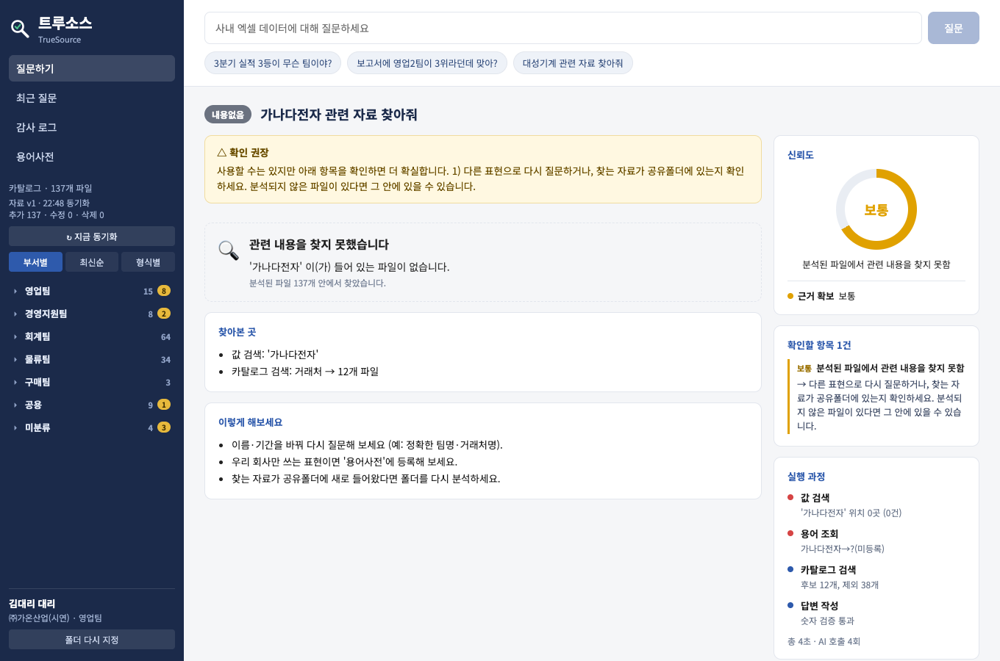</td>
    <td align="center">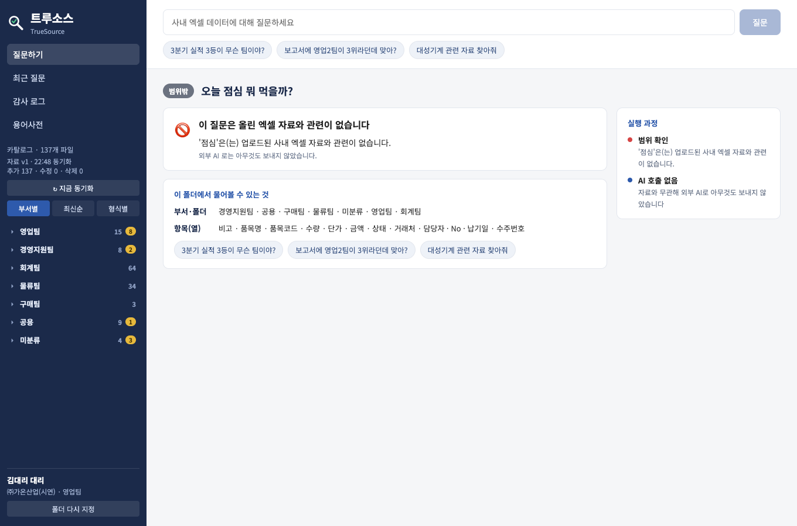</td>
  </tr>
  <tr>
    <td align="center">없으면 “없다”고 말하고, 찾아본 곳·분석 못 한 파일·다음 행동을 안내</td>
    <td align="center">엑셀과 무관한 질문은 AI를 부르지 않고 바로 안내</td>
  </tr>
</table>

### 근거 · 이력 · 용어사전 · 감사 로그

<table>
  <tr>
    <th align="center">근거 — 파일·시트·행·열</th>
    <th align="center">최근 질문</th>
  </tr>
  <tr>
    <td align="center">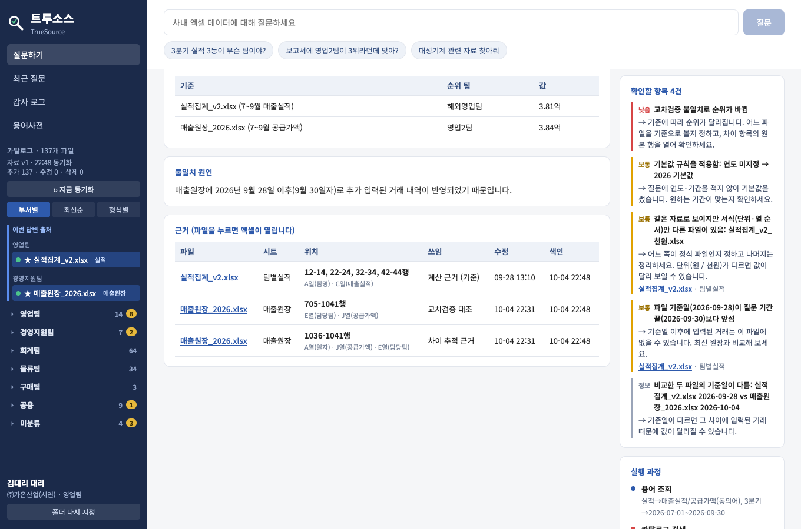</td>
    <td align="center">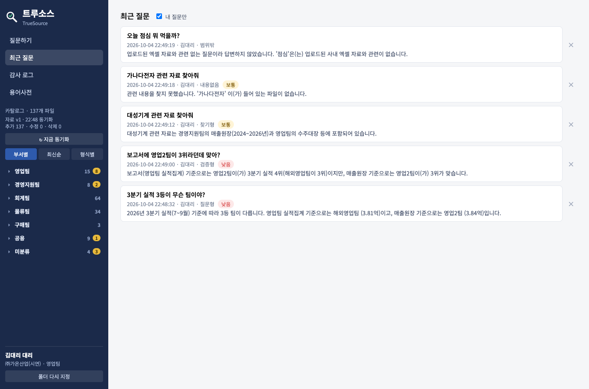</td>
  </tr>
  <tr>
    <td align="center">엑셀의 실제 행·열 번호를 보여 주고, 파일 이름을 누르면 엑셀이 열림</td>
    <td align="center">답변 전체(근거·신뢰도·실행 과정)가 저장되어 그대로 다시 열림</td>
  </tr>
  <tr>
    <th align="center">용어사전</th>
    <th align="center">감사 로그</th>
  </tr>
  <tr>
    <td align="center">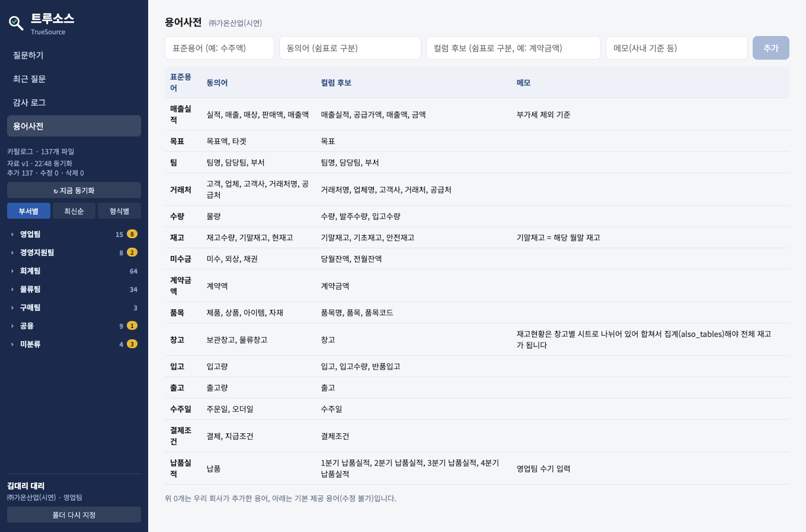</td>
    <td align="center">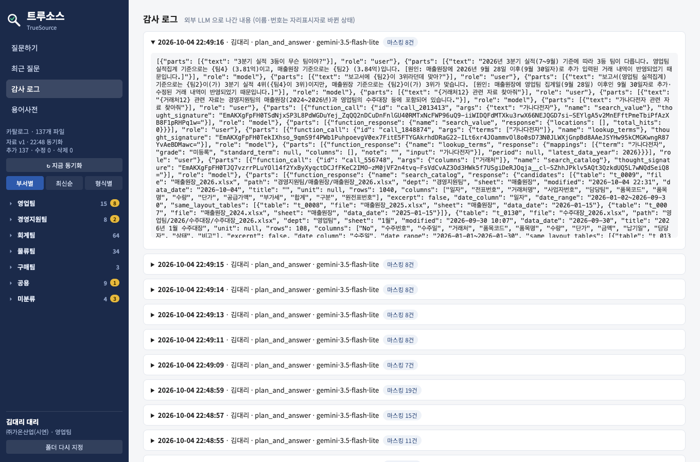</td>
  </tr>
  <tr>
    <td align="center">회사만 쓰는 표현을 등록하면 에이전트의 용어 조회에 바로 반영</td>
    <td align="center">“이번 질문에 외부로 나간 것은 이것뿐” — 이름·번호는 자리표시자로 바뀐 상태</td>
  </tr>
</table>

<sub>화면은 가상 회사 ㈜가온산업의 샘플 엑셀(137개)로 실제 질문을 실행해 캡처했습니다. 모든 회사명·사업자번호·인명은 가상입니다.</sub>

## 핵심 기능

### 1. 근거와 함께 답하는 질문 처리

- **세 가지 질문 방식**: 값을 묻는 *질문형*, 주장이 맞는지 확인하는 *검증형*, 자료의 위치를 찾는 *찾기형*. 유형은 사용한 도구에 따라 코드가 확정합니다.
- **교차검증이 기본**: 계산한 답은 다른 파일의 같은 지표와 비교한 뒤에만 나갑니다. 값이 다르면 두 기준을 병기하고, 기준일 이후에 입력된 거래를 날짜별로 대조해 **원인 후보**(예: 9/30 반품 1건 미반영)를 제시합니다.
- **근거 표**: 모든 답변에 파일 · 시트 · 사용한 행 범위(예: `705-1040행`) · 열(`E열(담당팀) · J열(공급가액)`) · 쓰임 · 수정·색인 시각을 붙입니다. 파일 이름을 누르면 **이 PC의 엑셀로 실제 파일이 열립니다**.
- **내용 없음 안내**: 분석된 파일에서 찾지 못하면 “없다”고 말하고, 찾아본 곳과 **분석하지 못한 파일(.xls 등)**, 비슷한 이름, 다음에 해볼 것을 알려 줍니다.
- **범위 밖 질문 관문**: 날씨·점심 같은 엑셀과 무관한 질문은 AI를 부르지 않고 규칙으로 걸러냅니다(의심스러우면 통과).
- **대화 이어가기**: “그럼 2위는?”처럼 직전 질문의 기간·대상을 이어받고, 모호하면 되묻습니다.

### 2. 규칙으로 판정하는 신뢰도

- **4개 신호**(매핑 확신도·교차검증·데이터 품질·실행 이상) 중 가장 낮은 등급이 최종 등급입니다. 숫자 검증·근거 확보 실패는 별도 신호로 반영합니다.
- **52개 규칙**이 구버전·사본·같은 기준일 충돌·백업 폴더·편집 중 잠금·결측·중복·합계 행 불일치·숨김 시트·인젝션 셀·기간 미커버·단위 불일치 등 사내 엑셀의 엣지케이스를 점검합니다.
- 높음이 아니면 **“왜 낮은지 · 무엇을 확인할지 · 어디인지(파일·시트·행·열)”**를 화면 맨 위 배너와 오른쪽 목록에 보여 줍니다.
- **편집 중 감지**: 누가 파일을 열어 두면 “김대리님이 이 파일을 열어 두고 있습니다. 수정 가능성이 있습니다”라고 알립니다(엑셀 잠금 파일에서 사용자 이름을 읽음).

### 3. 공유폴더 분석과 변경 감지

- **분석**: 폴더의 엑셀을 **읽기 전용**으로 열어 시트별 표로 바꿔 DuckDB에 올립니다. 제목·기준일·단위 줄, 소계·합계 행, 자료형 혼재, 엑셀 오류 셀을 규칙으로 처리하고 원본의 엑셀 행 번호를 보존합니다.
- **버전·사본 판정**: 같은 이름 계열(`_v2`, `_최종`, `(1)`, 복사본, `_old`)에서 기준일이 가장 늦은 파일을 기준으로 삼고, 바이트가 같은 파일은 사본, 값은 같고 서식·단위만 다른 파일은 서식 사본으로 구분합니다.
- **변경 동기화**: 파일 지문(경로·크기·수정시각·해시)으로 **추가 · 수정 · 삭제 · 이동**을 구분합니다. 10분마다 자동으로 확인하고, 사이드바의 **지금 동기화**로 바로 다시 읽을 수도 있습니다. 분석이 끝나면 “폴더가 바뀌어 자료를 새로 읽었습니다 (v2)” 알림이 뜹니다.
- **지난 답변도 지킴**: 답변의 근거 파일이 그 뒤에 바뀌면 “근거 파일이 답변 이후 바뀌었습니다”와 **다시 질문** 버튼을 표시하고, 질문 시점에도 근거 파일이 분석 이후 바뀌지 않았는지 다시 확인합니다.
- **용어 후보**: 새로 생긴 컬럼 이름을 용어사전 후보로 제안합니다.

### 4. 원본이 밖으로 나가지 않는 보안 구조

- **보안 게이트웨이**: 모든 LLM 호출이 단일 함수를 통과합니다. 권한 확인 → 허용 필드 검사 → **마스킹**(팀·거래처·담당자명, 사업자번호·전화·이메일) → **인젝션 문구 차단** → **감사 로그** → 호출 → 응답을 로컬에서만 실명 복원.
- **원본 행은 LLM에 가지 않습니다**: 집계값·위치·건수 같은 요약만 전달하고, 식별자 컬럼으로 묶기와 큰 결과는 거절합니다.
- **감사 로그 화면**: 외부로 나간 마스킹 후 내용을 그대로 보여 줍니다.
- 셀에 심어 둔 “이전 지시를 무시하라” 같은 문구는 LLM에 도달하지 않으며, 파일 안에서 발견되면 위치와 함께 경고합니다.

### 5. 회사 단위로 쓰는 업무 도구

- **회사별 저장소**: 회사마다 SQLite 파일이 따로 생겨 사용자, **질문 이력**(답변 전체 포함), **회사 용어사전**, 파일 지문, 동기화 로그가 남습니다. 다른 회사의 질문·용어는 보이지 않습니다.
- **동시 사용**: 한 회사 직원 여러 명이 동시에 질문할 수 있습니다. 동시 처리 수를 제한하고(기본 4개) 넘치는 질문은 줄을 세우며 **“지금 질문 N개가 처리 중이라 순서를 기다리고 있습니다”**를 보여 줍니다.
- **키 오류 안내**: Gemini API 키가 없거나 틀리면 화면 맨 위에 **“API 키 오류”**와 해결 방법을 즉시 보여 줍니다.
- **화면 구성**: 부서별·최신순·형식별로 접히는 파일 트리, 이번 답변의 출처 고정, 변경된 파일 배지, 입체 트루소스 아이콘 로딩.

## 기술 구조

### 기술 스택

| 구분 | 기술 | 용도 |
| :--- | :--- | :--- |
| 프론트엔드 | React 19, Vite 8 | 화면(질문·결과·이력·용어사전·감사 로그), 개발 프록시 |
| 백엔드 | FastAPI, Uvicorn | API, 질문 처리, 동시 처리 제한, 주기 동기화 |
| 엑셀 처리 | openpyxl | 시트를 읽기 전용으로 열어 표로 변환 |
| 분석 데이터 | DuckDB (인메모리) | 시트별 표·값 색인·집계 쿼리 |
| 회사 데이터 | SQLite (WAL) | 사용자·질문 이력·용어사전·파일 지문·동기화 로그 |
| LLM | Gemini API (`google-genai`) | 도구 선택·근거 판단·답변 작성(함수 호출) |
| 품질 | pytest, ruff, oxlint | 테스트 215개, 백엔드·프론트 린트 |

### 시스템 구성

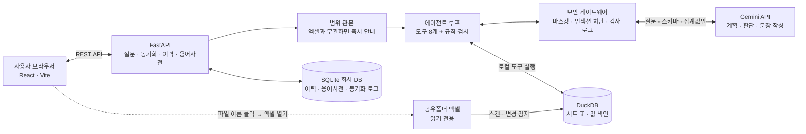

분석된 엑셀 데이터는 메모리(DuckDB)에만 있고, 회사 DB(SQLite)에는 이력·용어사전·동기화 로그만 저장합니다. 백엔드를 재시작하면 공유폴더를 다시 읽습니다.

### 질문 처리 흐름

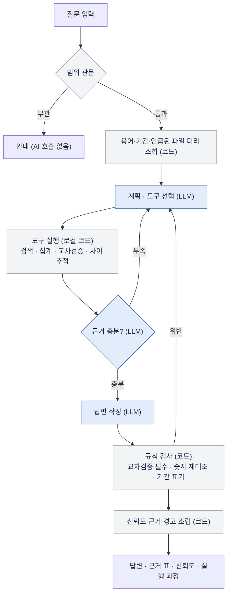

LLM이 관여하는 곳은 **계획·근거 충분 판단·답변 작성** 세 곳뿐입니다. 도구 실행, 신뢰도 판정, 숫자 검증은 코드가 합니다.

### 질문 유형별 처리

| 입력 | 처리 | 사용자에게 제공하는 정보 |
| :--- | :--- | :--- |
| 값을 묻는 질문 | 용어 조회 → 카탈로그 검색 → 집계 → 다른 파일로 교차검증 → (불일치면) 차이 추적 | 답, 기준별 판정표, 원인, 근거 표, 신뢰도 |
| 주장을 확인하는 질문 | 주장을 기준별로 계산·교차검증 | 판정(맞음·부분적으로 틀림 등), 주장 대 확인 표, 원인 |
| 자료를 찾는 질문 | 값 역색인 검색 | 파일·시트·칸·행, 관련도, 구버전·사본·편집 중 표시 |
| 자료에 없는 질문 | 찾아본 곳 기록 | “없음” 안내, 분석 못 한 파일, 비슷한 이름, 다음에 할 일 |
| 모호한 질문 | 되묻기 | 선택지 버튼 |

### 도구 8개 (모두 로컬)

| 도구 | 하는 일 | LLM이 받는 것 |
| :--- | :--- | :--- |
| `lookup_terms` | 질문 속 용어·기간을 용어사전으로 컬럼·날짜 범위에 매핑 | 매핑 컬럼, 일치 등급(정확·동의어·미등록), 기간 |
| `search_catalog` | 필요한 컬럼을 가진 시트 검색(`'A\|B'` 대안, 파일 이름 지정 `file`, 질문의 연도 자동 적용). 구버전·사본·서식만 다른 사본은 `excluded`로 분리, 발췌본은 뒤로. 합칠 수 있는 같은 구조의 표는 `same_layout_tables`, 결과가 없으면 가장 가까운 표·실제 컬럼명 힌트 | 후보 표(table), 컬럼, 날짜 범위, 단위, 신선도 |
| `search_value` | 특정 값(팀명·거래처명)이 있는 위치 검색 | 파일·시트·컬럼·건수 (행 내용 없음) |
| `run_query` | JSON 명세를 검증해 집계 실행(원본 행은 반환 안 함). 금액은 원 단위로 환산. 열끼리 비교(`value_column`, 예: 기말재고 < 안전재고), 상위 N개(`limit`), 같은 구조의 여러 시트·파일 합산(`also_tables`) 지원 | 집계값, 사용 행 수, 순위, 숫자가 실제로 걸친 기간(`period_covered`) |
| `cross_verify` | 같은 지표를 다른 파일(다른 표)의 결과와 비교 | 일치 여부, 차이, 순위 변동 |
| `trace_difference` | 기준일 이후 입력된 거래를 묶어 불일치 원인 후보 제시 | 건수·합계 |
| `check_quality` | 결측·중복·버전 상태 | 품질 요약 |
| `ask_user` | 모호한 용어·기준을 사용자에게 되묻기 (처리를 멈추고 답을 기다림) | 사용자 응답 |

### 코드가 강제하는 규칙

LLM이 도구와 순서를 스스로 고르지만, **자율성의 경계는 코드가 강제**합니다.

- 도구 호출 총 **10회** 상한(초과 시 `final_answer`만 허용), `run_query` 실패 재시도 **2회**, 질문 하나는 **120초**에서 중단
- 계산을 했다면 **교차검증 없이는 답할 수 없음**(다른 파일의 다른 표여야 인정). 계산이 없는 찾기형은 예외이며 “교차검증 불가”로 표시
- 답변 속 숫자(억·만원·원·%·소수)는 **도구 결과에 없으면 거절**하고 재작성(최대 2회). 끝내 불일치하면 신뢰도를 낮춤
- **같은 지표끼리만 교차검증**: 매출실적↔공급가액은 가능, 매출실적↔재고는 거절. 납품실적↔매출실적은 “서로 다른 지표” 안내(X11)와 함께 허용(계약현황 수기 입력 검증용)
- **순위 질문은 전체 순위를 비교**: 한 항목만 필터링해 비교하면 거절(기회 2번 후 X12). 이긴 항목 하나가 맞아도 순위가 맞다는 뜻은 아니기 때문
- **독립된 두 번째 자료가 없을 때**: `no_cross_reason`에 이유를 적으면 허용(X10). 날짜가 다른 현황표·‘발췌’ 파일·같은 계열 사본끼리의 비교는 인정하지 않음. 모델이 끝내 못 따라 하면 “교차검증 못 함(낮음)”으로 내보냄
- **여러 시트·파일 합산은 이중 집계를 막는 조건에서만**: 같은 통합문서의 시트(창고별 등)이거나 기간이 겹치지 않는 파일(월별 장부). 재고·잔액 같은 현황 수치를 다른 파일끼리 합치는 것, 기간이 겹치는 표(발췌·다른 버전)의 합산은 금지
- **답변의 기간 표기 검증(P3)**: “3분기”라고 했는데 인용한 숫자가 1~9월 누계에서 나왔으면 낮음. 질문에 기간이 없으면 조회한 실제 범위를 밝히게 함(M4)
- 실패·빈 결과·처음 두 번의 용어 조회는 호출 한도에서 돌려주고(최대 6번), 똑같은 호출을 되풀이하면 이전 결과를 돌려줌
- 모델이 형식을 빠뜨리거나(판정표 `checks` 누락 등) 자리표시자를 지어내도 코드가 보정·재작성시켜 화면이 깨지지 않음

### 신뢰도 판정

“**이 숫자를 그대로 믿어도 되는가**”를 뜻하며 정답일 확률이 아닙니다. 등급은 **낮음**(확인 전에는 쓰지 말 것) · **보통**(쓸 수는 있으나 해당 항목 확인) · **정보**(표시만)입니다.
점검은 도구가 파일·시트·행을 읽을 때마다 자동으로 일어나므로 LLM이 호출을 빠뜨려도 건너뛰지 않습니다. 결론 변경은 “교차검증에서 **순위가 달라지는지**”로 판정하고, 원인을 특정하면 사유에 “(원인 확인됨)”이 붙습니다.

<details>
<summary>52개 규칙 전체 보기</summary>

**매핑 확신도** (4개)

| 규칙 | 등급 | 이런 경우 | 확인할 것 |
| :--- | :--- | :--- | :--- |
| M1 | 낮음 | 사전에 없는 표현을 추정해 컬럼에 연결함: … | '…'가 실제로 어떤 컬럼을 뜻하는지 확인하고, 맞다면 용어사전에 등록하세요. |
| M2 | 보통 | 기본값 규칙을 적용함: … | 질문에 연도·기간을 적지 않아 기본값을 썼습니다. 원하는 기간이 맞는지 확인하세요. |
| M4 | 보통 | 질문에 기간이 없어 파일 전체 기간(…)을 조회함 | 원하는 기간(예: 3분기, 9월)을 정해 다시 질문하면 더 정확합니다. 지금 숫자는 … 전체의 값입니다. |
| M3 | 보통 | 용어 조회 없이 질의함 | 용어가 올바른 컬럼에 연결됐는지 확인되지 않았습니다. 사용한 컬럼이 질문과 맞는지 보세요. |

**교차검증** (12개)

| 규칙 | 등급 | 이런 경우 | 확인할 것 |
| :--- | :--- | :--- | :--- |
| X1 | 낮음 | 계산했지만 다른 파일로 교차검증을 하지 못함 | 다른 파일의 같은 지표와 직접 비교해 보세요. 비교할 두 번째 자료가 있는지도 확인하세요. |
| X2 | 보통 | 교차검증 불일치가 있으나 순위는 같음 (최대 차이 …) | 두 파일의 차이 항목을 확인하세요. 기준일·단위·집계 범위가 다른지 보면 됩니다. |
| X3 | 낮음 | 교차검증에서 큰 불일치가 있음 (최대 차이 …) | 같은 내용의 두 파일 값이 … 넘게 다릅니다. 어느 쪽이 기준인지 담당자에게 확인하세요. |
| X4 | 낮음 | 교차검증 불일치로 순위가 바뀜 | 기준에 따라 순위가 달라집니다. 어느 파일을 기준으로 볼지 정하고, 차이 항목의 원본 행을 열어 확인하세요. |
| X5 | 보통 | 한쪽 파일에만 있는 항목이 있어 비교하지 못함: … | 같은 대상이 표기만 다르게(㈜ 유무, 띄어쓰기 등) 적혔을 수 있습니다. 항목 이름을 맞춰 보세요. |
| X6 | 낮음 | 두 자료의 단위가 다를 가능성이 큼 (약 …배 차이) | 한쪽 파일이 천원·백만원 단위일 수 있습니다. 각 파일 맨 위의 '단위' 표기를 확인하세요. |
| X7 | 정보 | 비교한 두 파일의 기준일이 다름: … | 기준일이 다르면 그 사이에 입력된 거래 때문에 값이 달라질 수 있습니다. |
| X8 | 보통 | 불일치의 원인을 특정하지 못함 | 차이 항목의 행을 날짜별로 대조해 어느 쪽에 빠진 거래가 있는지 확인하세요. |
| X10 | 보통 | 독립된 두 번째 자료가 없어 교차검증하지 못함: … | 단일 출처의 값입니다. 담당자에게 원본(근거 표의 파일·행)을 확인하세요. |
| X11 | 정보 | 서로 다른 지표를 비교함: … 대 … | 같은 사실을 다른 시점에 적은 값이라 완전히 같지 않을 수 있습니다(예: 수기 입력된 납품실적). |
| X12 | 보통 | 순위를 묻는 질문인데 …개 항목만 비교해 순위가 맞는지 검증되지 않음 | 한 항목의 값이 일치해도 순위가 같다는 뜻은 아닙니다. 두 자료의 전체 항목(상위 5개 이상)을 같은 기준으로 비교해 보세요. |
| X9 | 보통 | 교차검증 불가 (계산 없는 질문) | 계산 없이 위치만 찾은 결과입니다. 열어 본 파일의 내용을 직접 확인하세요. |

**데이터 품질** (27개)

| 규칙 | 등급 | 이런 경우 | 확인할 것 |
| :--- | :--- | :--- | :--- |
| V1 | 낮음 | 구버전 파일을 기준으로 사용함: … | 같은 계열의 더 최신 파일(…)이 있습니다. 그 파일과 값을 비교해 보세요. |
| V2 | 보통 | 원본이 아닌 사본 파일을 사용함: … | 이 파일은 …와 내용이 같은 사본입니다. 원본 위치의 파일을 기준으로 삼으세요. |
| V3 | 낮음 | 같은 계열·같은 기준일(…)인데 내용이 다른 파일이 있어 기준 파일을 정할 수 없음: … | 어느 파일이 맞는 최신본인지 담당자에게 확인하고, 이름에 버전을 붙여 정리하세요. |
| V3F | 보통 | 같은 자료로 보이지만 서식(단위·열 순서)만 다른 파일이 있음: … | 어느 쪽이 정식 파일인지 정하고 나머지는 정리하세요. 단위(…)가 다르면 값이 달라 보일 수 있습니다. |
| V4 | 보통 | 시트 기준일(…)보다 …일 뒤에 수정된 파일 | 기준일 이후에 고친 내용이 있습니다. 시트 상단의 기준일 표기가 갱신됐는지 확인하세요. |
| V5 | 보통 | 백업·개인·임시 위치의 파일을 사용함: … | 정식 부서 폴더의 파일이 아닙니다. 같은 자료의 정식 파일이 있는지 확인하세요. |
| V6 | 보통 | 초안·임시·발췌 성격의 파일로 보임: … | 파일 이름이나 제목에 '…' 표시가 있습니다. 확정된 자료인지 확인하세요. |
| V7 | 보통 | … 이 파일을 열어 두고 있습니다…. 수정 가능성이 있습니다 | 저장되지 않은 수정이 있을 수 있습니다. …에게 저장 여부를 확인한 뒤 숫자를 사용하세요. |
| V8 | 낮음 | 분석 이후 파일이 바뀜 (수정시각·크기 변화) | 분석한 내용이 최신이 아닙니다. 폴더를 다시 분석한 뒤 다시 질문하세요. |
| V9 | 낮음 | 분석 이후 파일을 찾을 수 없음 (삭제·이동됨) | 파일이 이동되거나 삭제됐습니다. 폴더를 다시 분석하세요. |
| V10 | 낮음 | 질문한 연도(…)와 다른 연도의 파일로 보임 | 파일 제목·이름에 …가 적혀 있습니다. 올바른 연도 파일인지 확인하세요. |
| V11 | 보통 | 숨겨진 시트의 값을 사용함: … | 숨김 처리된 시트는 작성자가 일부러 감춘 자료일 수 있습니다. 사용해도 되는 자료인지 확인하세요. |
| P1 | 낮음 | 표의 날짜 범위(…)가 질문 기간(…)을 다 덮지 못함 | 해당 기간의 데이터 일부가 파일에 없습니다. 누락된 기간의 자료를 따로 확인하세요. |
| P1M | 보통 | 표의 날짜 범위(…)가 질문 기간(…)의 끝부분을 덮지 못함 (…일) | 기간 끝쪽의 며칠분이 파일에 없을 수 있습니다. 마지막 입력 날짜가 맞는지 확인하세요. |
| P3 | 낮음 | 답변은 '…'라고 했지만, 인용한 숫자는 … 범위의 값임 | 답변의 기간 표현과 실제 조회 기간이 다릅니다. 숫자가 어느 기간의 값인지 근거 표의 행 범위로 확인하세요. |
| P2 | 보통 | 파일 기준일(…)이 질문 기간 끝(…)보다 앞섬 | 기준일 이후에 입력된 거래는 이 파일에 없을 수 있습니다. 최신 원장과 비교해 보세요. |
| D1 | 보통 | 사용한 컬럼에 빈 값이 있어 계산에서 빠짐: …행 (…) | 비어 있는 칸(…)을 확인하고 채워야 할 값인지 보세요. |
| D1H | 낮음 | 사용한 컬럼의 빈 값이 많음: …행 (…) | 전체의 …가 비어 있어 합계가 크게 달라질 수 있습니다. 빈 칸(…)을 확인하세요. |
| D2 | 보통 | 완전히 같은 행이 중복됨: …행 | 같은 거래가 두 번 입력됐을 수 있습니다. 중복 행(…)이 실제 별개 거래인지 확인하세요. |
| D2H | 낮음 | 중복 행이 합계에 큰 영향을 줌: …행, 합계의 … | 중복 입력이면 합계가 부풀려집니다. 중복 행(…)을 확인하세요. |
| D3 | 낮음 | 파일의 합계 행(…)이 실제 데이터 합(…)과 다름 | 합계가 값으로 붙여넣어져 갱신되지 않았을 수 있습니다. 합계 행(…)을 확인하세요. |
| D4 | 낮음 | 숫자와 문자가 섞인 열을 사용함: … | 문자로 입력된 숫자는 계산에서 빠질 수 있습니다. 해당 열의 값 형식을 확인하세요. |
| D5 | 보통 | 수식 오류 셀 …개를 빈 값으로 처리함 | #REF!, #DIV/0! 같은 오류 셀이 있습니다. 원본에서 오류를 고친 뒤 다시 분석하세요. |
| D6 | 보통 | 계산 결과가 저장되지 않은 수식 …개를 빈 값으로 처리함 | 엑셀에서 파일을 한 번 열어 저장하면 해결됩니다. |
| D7 | 낮음 | 행이 너무 많아 일부만 읽음 (…행까지) | 뒷부분 데이터가 계산에서 빠졌습니다. 파일을 나눠 저장하거나 행 한도를 늘리세요. |
| D8 | 보통 | 부가세가 포함된 '…' 컬럼을 사용함 | 사내 기준은 부가세 제외입니다. 공급가액 컬럼과 값이 맞는지 확인하세요. |
| D9 | 보통 | 파일 안에 지시문처럼 보이는 문장이 있어 무시함 (…) | 누군가 일부러 넣은 문장일 수 있습니다. 해당 셀(…)을 확인하고 지우세요. |

**실행 이상** (6개)

| 규칙 | 등급 | 이런 경우 | 확인할 것 |
| :--- | :--- | :--- | :--- |
| E1 | 낮음 | 쿼리가 재시도 후에도 실패함 | 필요한 컬럼이 없거나 형식이 달라 계산하지 못했습니다. 질문을 더 구체적으로 바꿔 보세요. |
| E2 | 보통 | 쿼리를 한 번 고쳐서 다시 실행함 | 처음 계산이 실패해 조건을 바꿨습니다. 사용한 조건이 질문과 맞는지 확인하세요. |
| E3 | 보통 | 조건에 맞는 데이터가 없는 빈 결과가 있음 | 기간·이름 조건이 데이터와 맞는지 확인하세요. 이름 표기가 다를 수 있습니다. |
| E4 | 보통 | 음수 합계가 나옴 | 반품·취소가 합산됐는지 확인하세요. 의도한 값이 아니면 구분 조건을 점검하세요. |
| E5 | 보통 | 도구 호출 상한에 도달해 조사가 중간에 끝남 | 더 확인할 것이 남았을 수 있습니다. 질문을 나눠서 다시 물어보세요. |
| E6 | 낮음 | AI가 정해진 형식으로 답하지 못해 요약만 표시함 | 근거 표가 없는 답변입니다. 같은 질문을 다시 해 보세요. |

**숫자 검증** (1개)

| 규칙 | 등급 | 이런 경우 | 확인할 것 |
| :--- | :--- | :--- | :--- |
| N1 | 낮음 | 답변 속 일부 숫자가 계산값과 일치하지 않음: … | 표시된 숫자를 그대로 믿지 말고 출처 파일의 값과 직접 대조하세요. |

**근거 확보** (2개)

| 규칙 | 등급 | 이런 경우 | 확인할 것 |
| :--- | :--- | :--- | :--- |
| S2 | 보통 | 분석된 파일에서 관련 내용을 찾지 못함 | 다른 표현으로 다시 질문하거나, 찾는 자료가 공유폴더에 있는지 확인하세요. 분석되지 않은 파일이 있다면 그 안에 있을 수 있습니다. |
| S1 | 낮음 | 답의 근거가 되는 파일이 없음 | 근거 없이 작성된 답입니다. 사용하지 말고 질문을 다시 해 보세요. |

</details>

### 보안 게이트웨이

모든 LLM 호출은 `agent/gateway.py`의 `call_llm` 한 곳을 지납니다.

| 단계 | 처리 |
| :--- | :--- |
| 1. 권한 확인 | 사용자 정보와 허용된 호출 목적 |
| 2. 허용 필드 검사 | 스키마·집계값만 통과, 원본 행 형태·긴 목록·`raw_rows`는 차단 |
| 3. 마스킹 | 값 색인에서 알아낸 팀·거래처·담당자명을 `{팀1}`·`{거래처3}`으로, 사업자번호·전화·이메일은 정규식으로 치환 |
| 4. 인젝션 차단 | “이전 지시 무시”, AI 호명, “교차검증 생략·신뢰도 조작” 같은 문구는 `[차단됨]`으로 치환 |
| 5. 감사 로그 | **외부로 나간 마스킹 후 내용**을 그대로 저장(`GET /api/audit`) |
| 6. 호출 | Gemini API. 429·서버 혼잡은 최대 3번 재시도(대기 최대 20초), 키 오류는 재시도 없이 즉시 안내 |
| 7. 복원 | 응답의 자리표시자를 **로컬에서만** 실명으로 복원(중괄호를 빼먹은 경우 포함) |

### 데이터 준비 — 공유폴더에서 표로

<details>
<summary>엑셀을 표로 바꾸는 규칙과 변경 동기화</summary>

- **헤더 행**: 위쪽 30행 중 대부분이 글자이고 표 너비의 60% 이상을 채우는 첫 행. 그 위 줄은 제목·기준일·단위 등 **머리말**로 보관하고, 표는 A열에서 시작하지 않아도 됩니다.
- **소계·합계 행**은 지우지 않고 `_row_kind`로 표시해 합계 계산에서 제외합니다(이중 집계 방지).
- 모든 행에 **원래 엑셀 행 번호**(`_row`)를 보존해 근거 표에서 그대로 인용합니다.
- 열 형식(정수·실수·날짜·글자)은 데이터에서 추론하고, 엑셀 오류 셀은 빈 값으로 처리하며 개수를 셉니다.
- 파일은 읽기 전용으로 열고, 엑셀에 저장된 계산값을 씁니다(수식은 재계산하지 않고 계산값이 없는 수식은 개수를 보고).
- 건너뛰는 것: `~$` 잠금 파일, macOS 사이드카(`._*`), `.xls`(개수만 표시), 심볼릭 링크, 시스템 폴더, 용량 100MB 초과.
- **파일 지문**(경로·수정시각·크기·해시)을 저장하고 다음 스캔과 비교해 추가·수정·삭제를 구분하며, 삭제+추가인데 해시가 같으면 **이동**(기억 유지)으로 봅니다.
- 한 시트의 읽기 한도는 30만 행입니다(초과 시 경고).

</details>

### 회사별 저장소

| 저장 | 내용 |
| :--- | :--- |
| 사용자 | 로그인 시 이름·소속·직책 등록 |
| 최근 질문 | 질문과 **답변 전체**(근거·출처·신뢰도·실행 과정). 화면의 “최근 질문”에서 그대로 다시 열기 |
| 용어사전 | 회사가 추가한 용어(동의어·컬럼 후보). 기본 용어보다 먼저 적용 |
| 용어 후보 | 스캔에서 처음 보인 컬럼 이름을 후보로 제안(무시 가능) |
| 파일 지문·동기화 로그 | 스캔마다 지문 저장, 이전 스캔과 비교한 추가·수정·삭제·이동과 자료 버전 기록 |

회사 DB는 `backend/data/<회사해시>/company.db`(git 제외)이며 WAL 저널로 열립니다.

### API

| 메서드 | 경로 | 설명 |
| :--- | :--- | :--- |
| POST | `/api/login` | 회사 DB 열기/생성 + 사용자 등록 → 마지막 폴더, 로드 여부 |
| POST | `/api/scan` | 공유폴더 스캔 시작 `{"path": "...", "company": "..."}` |
| GET | `/api/scan/status` · `/api/catalog` | 진행률 · 파일 목록(부서·신선도·사본 관계·편집 중) |
| POST | `/api/sync` | 지금 동기화(변경 알림용 결과 포함) |
| POST | `/api/sources/check` | 지난 답변의 근거 파일이 그 뒤에 바뀌었는지 확인 |
| POST | `/api/query` | 질문 `{"question", "user", "session_id"}` → 답변. 질문·답변은 회사 DB에 저장 |
| GET | `/api/queue` | 동시 처리 상한·처리 중·대기 중 질문 수 |
| GET·DELETE | `/api/history` · `/api/history/{id}` | 최근 질문 목록 · 저장된 답변 · 삭제 |
| GET·POST·DELETE | `/api/glossary` | 용어사전(기본 + 회사 추가분) |
| GET·POST | `/api/glossary/candidates` · `…/dismiss` | 새 컬럼 용어 후보 · 무시 |
| GET | `/api/scan/log` | 회사별 동기화 로그 |
| GET | `/api/audit` | 외부 LLM으로 나간 내용(마스킹 후) |
| GET | `/api/llm/status` · `/api/llm/check` | 키 설정 여부·모델 · 키가 실제로 쓸 수 있는지 점검 |
| POST | `/api/open` | 근거 파일을 이 PC의 엑셀로 열기(스캔된 엑셀만, 이 PC에서만) |
| GET | `/api/health` | 서버 응답 확인 |

<details>
<summary><code>/api/query</code> 응답 필드</summary>

`type`(질문형·검증형·찾기형·되묻기·내용없음·범위밖), `answer`, `confidence`, `confidence_reason`, `confidence_signals`(신호별 등급),
`warnings`(규칙이 발견한 항목: 제목·확인할 것·위치), `check_message`, `no_data`, `comparison_table`, `claim`, `cause`,
`sources`(파일·시트·행·열·쓰임·수정·색인 시각), `search_results`, `trace`(실행 과정), `tool_calls`, `number_check`,
`timing`(총 시간·AI 호출 수·한도 대기), `data_version`, `source_stamps`, `session_id`, `history_id`, `ask`(되묻기일 때).

`type`은 사용한 도구에 따라 코드가 확정합니다(값 검색만 쓰면 찾기형, 판정표가 있으면 검증형).

</details>

## 시연 시나리오

샘플 데이터(㈜가온산업)에는 같은 데이터의 여러 버전과 일부러 넣은 오류가 들어 있어, 트루소스가 하는 일이 그대로 드러납니다.

1. **질문**: “3분기 실적 3등이 무슨 팀이야?” → 집계 파일(`실적집계_v2`)은 해외영업팀, 매출원장은 영업2팀. 두 기준 병기, 9/28 이후 입력 거래 5건이 원인, 신뢰도 **낮음**과 확인할 항목.
2. **검증**: “보고서에 영업2팀이 3위라던데 맞아?” → 기준별로 맞는 쪽과 틀린 쪽을 판정.
3. **찾기**: “대성기계 관련 자료 찾아줘” → 파일·시트·칸·행을 보여 주고, 편집 중인 `수주대장_2026`은 경고. 파일 이름을 누르면 엑셀이 열림.
4. **함정**: “계약현황에서 3분기 납품실적 1위 거래처는?” → 계약현황은 제일기공, 매출원장은 Hanoi Machinery가 1위. 계약현황의 일부 값이 갱신되지 않은 것을 짚어 줌.
5. **없는 것**: “가나다전자 관련 자료 찾아줘” → “없다”고 답하고 찾아본 곳과 다음 행동 안내.
6. **변경 감지**: 엑셀을 고치거나 파일을 추가·삭제 → 10분 안에(또는 **지금 동기화**) “폴더가 바뀌어 자료를 새로 읽었습니다”, 이전 답변에는 “근거 파일이 바뀌었습니다” + 다시 질문.
7. **보안**: 감사 로그 화면에서 이번 질문에 외부로 나간 것은 마스킹된 이 내용뿐임을 확인.

## 프로젝트 구조

```text
truesource-web/
├── src/                        # React 화면
│   ├── App.jsx                 # 흐름: 시작 → 분석 → 질문·이력·용어사전·감사 로그
│   ├── api/                    # 백엔드 호출
│   ├── components/             # 시작 화면·사이드바(파일 트리)·로딩·근거 표·경고·이력·용어사전·감사 로그
│   │   └── cards/              # 답변·판정표·근거 표·신뢰도 게이지·실행 과정 카드
│   └── layouts/                # 질문형·검증형·찾기형·되묻기·내용 없음·범위 밖 화면
├── public/                     # 파비콘
├── docs/images/                # README 화면 이미지
└── backend/
    ├── app/
    │   ├── main.py             # FastAPI 진입점·API·동시 처리 제한
    │   ├── scanner.py          # 폴더 훑기(잠금 파일·변경 대상)
    │   ├── converter.py        # 시트 → 표 변환 규칙
    │   ├── catalog.py          # 버전·사본·기준일 판정
    │   ├── store.py            # DuckDB 저장·값 색인
    │   ├── service.py          # 스캔 실행·동기화·진행률
    │   ├── companydb.py        # 회사별 SQLite(이력·용어사전·동기화 로그)
    │   ├── limiter.py          # 동시 질문 상한과 대기열
    │   ├── opener.py           # 근거 파일 엑셀로 열기(안전장치)
    │   └── agent/
    │       ├── runner.py       # 에이전트 루프·규칙 강제·응답 조립
    │       ├── tools.py        # 도구 8개
    │       ├── audits.py       # 신뢰도 규칙 발동 지점(파일·행·기간)
    │       ├── rules.py        # 52개 신뢰도 규칙 정의
    │       ├── confidence.py   # 신호별 등급·이유·확인 안내
    │       ├── gateway.py      # 보안 게이트웨이·마스킹·감사 로그
    │       ├── scope.py        # 범위 밖 질문 관문
    │       ├── glossary.py     # 용어사전·기간 규칙
    │       └── numbers.py      # 답변 속 숫자 재대조
    ├── tests/                  # 215개 (실제 게이트웨이를 통과하는 에이전트 테스트 포함)
    └── requirements.txt
```

데이터 계층 상세는 [backend/README.md](backend/README.md)에도 있습니다.

## 개발 환경

프론트엔드(Vite)와 백엔드(FastAPI)를 각각 실행하는 구조입니다. 개발 중 `/api`는 Vite 프록시가 백엔드(8000번 포트)로 넘깁니다.

<details>
<summary>사전 준비와 환경 변수</summary>

- Node.js **20.19 이상**(또는 22.12 이상)과 npm
- Python **3.10 이상**
- Gemini API 키. **사내 데이터를 보내므로 학습에 쓰이지 않는 유료(결제 연결) 등급을 권장**하며, 무료 키는 호출 한도(429)에 금방 걸립니다.

```bash
git clone https://github.com/307701kk/truesource-web.git
cd truesource-web
npm install
```

`backend/.env.example`을 `backend/.env`로 복사해 값을 채웁니다(`.env`는 git에 올라가지 않습니다).

| 변수 | 기본값 | 설명 |
| :--- | :--- | :--- |
| `GEMINI_API_KEY` | (필수) | Gemini API 키 |
| `GEMINI_MODEL` | `gemini-3.8-flash` | 사용할 모델 ID. 계정에서 호출 가능한 모델로 지정 |
| `TRUESOURCE_MAX_CONCURRENT` | `4` | 동시에 처리할 질문 수 |
| `TRUESOURCE_DATA_DIR` | `backend/data` | 회사 DB 위치 |
| `TRUESOURCE_SYNC_SECONDS` | `600` | 폴더 변경 확인 간격(0이면 끔) |
| `TRUESOURCE_ALLOWED_ROOTS` | (없음) | 스캔을 허용할 상위 폴더(`;` 또는 `:`로 구분) |
| `TRUESOURCE_CORS_ORIGINS` | `localhost:5173` 등 | 허용할 화면 주소 |

</details>

<details>
<summary>백엔드 설치·실행</summary>

```bash
cd backend
python3 -m venv .venv
source .venv/bin/activate          # Windows: .venv\Scripts\activate
pip install -r requirements.txt
cp .env.example .env               # GEMINI_API_KEY 입력
uvicorn app.main:app --host 127.0.0.1 --port 8000
```

서버는 `127.0.0.1`로 실행하고, 필요하면 `TRUESOURCE_ALLOWED_ROOTS`로 스캔 허용 폴더를 제한합니다. 코드를 바꾼 뒤에는 백엔드를 다시 시작해야 반영됩니다(`--reload`를 쓰면 자동).

</details>

<details>
<summary>프론트엔드 실행과 사용 순서</summary>

```bash
npm run dev            # http://127.0.0.1:5173
npm run build          # 배포용 빌드
npm run lint           # oxlint
```

1. 시작 화면에서 회사명·이름·소속·직책을 입력합니다.
2. **공유폴더 경로**를 입력하고 분석을 시작합니다(샘플은 `…/가온산업_가상데이터/공유폴더`. 채점용 `정답지/`가 포함되지 않게 `공유폴더`까지만 지정).
3. 질문하고, 근거 표의 파일 이름을 눌러 엑셀로 열어 대조합니다.
4. 사이드바에서 **최근 질문 · 용어사전 · 감사 로그**를 확인하고, 폴더가 바뀌면 **지금 동기화**를 누릅니다.

</details>

<details>
<summary>테스트</summary>

```bash
cd backend && pip install -r requirements-dev.txt
TRUESOURCE_DATASET=<가온산업_가상데이터 경로> pytest -q     # 215개 (데이터셋이 없으면 일부 건너뜀)
ruff check . && ruff format --check .
```

- 에이전트 테스트는 **LLM만 스크립트로 바꾸고 실제 게이트웨이(마스킹·감사·인젝션 필터)를 그대로 통과**시킵니다.
- `test_rules.py`는 사내 엑셀의 엣지케이스를 합성 엑셀로 재현해 규칙마다 발동을 검증합니다.
- `test_questions.py`는 실제 질문을 돌려 찾은 결함(합산·기간 표기·순위 교차검증·없는 이름 등)의 회귀 테스트입니다.
- `test_concurrency.py`는 50개 질문 동시 전송과 대기열, 회사 불일치 거절을 검증합니다.
- `test_dataset.py`는 샘플 데이터를 **원본 상태**로 가정합니다. 샘플 엑셀을 고친 뒤에는 실패합니다.

</details>

<details>
<summary>문제 해결</summary>

| 증상 | 원인과 해결 |
| :--- | :--- |
| 화면 맨 위에 “API 키 오류” | `backend/.env`의 `GEMINI_API_KEY`를 확인하고 백엔드를 재시작. 프로젝트(계정)가 접근 거부되면 새 키·프로젝트가 필요 |
| “요청 한도 초과” | Gemini 호출 한도(분당·일일). 잠시 후 다시 질문하거나 유료 등급·한도를 확인. 동시 처리 수(`TRUESOURCE_MAX_CONCURRENT`)를 낮추면 완화 |
| `attempt to write a readonly database` | exFAT 외장 드라이브의 SQLite 기본 저널 문제. 회사 DB는 WAL(안 되면 메모리 저널)로 열도록 처리돼 있음. 백업할 때는 `company.db-wal`·`-shm`도 함께 복사 |
| 재시작 후 카탈로그가 비어 있음 | 분석 데이터는 메모리에 있어 재시작하면 사라집니다. 로그인하면 마지막 폴더 경로가 채워지니 **분석 시작**을 다시 누름 |
| 데이터셋 테스트 실패 | 샘플 엑셀을 수정한 경우. 샘플 생성기로 원본을 다시 만들어야 통과 |
| 외장 드라이브에 `._*` 파일 생김 | macOS가 만드는 사이드카. 앱은 무시하며 `.gitignore`에 포함 |

</details>

## 알려진 한계

- 분석된 엑셀 데이터(DuckDB)는 메모리에만 있어 백엔드를 재시작하면 다시 스캔해야 합니다. 이력·용어사전은 유지됩니다.
- **한 서버는 한 회사**가 씁니다(다른 회사 이름의 질문은 거절). 로그인 인증이 없어 사내 PC·사내망에서 실행하는 것을 가정합니다.
- 속도와 동시 사용의 실질 한도는 **Gemini 호출 한도**가 정합니다. 질문 하나가 LLM을 5~12번 부르며, 동시 사용자가 늘면 유료 등급이 필요합니다. 한도 대기는 실행 과정에 표시됩니다.
- 작은 모델(예: flash-lite)은 서술이 덜 구체적이고 도구를 덜 효율적으로 씁니다. 사실 판정은 코드가 하므로 틀린 서술은 경고로 걸러지지만, 완전히 없애지는 못합니다.
- 파일을 누르면 그 엑셀이 열리지만 특정 시트·셀로 바로 이동하지는 못합니다(위치는 근거 표에 `시트 · 행 · 열`로 표시).
- 편집 중 감지는 엑셀이 만드는 잠금 파일에 의존하며, 서버(SMB)의 열린 파일 목록 조회는 지원하지 않습니다.
- 폴더 변경 감지는 전체를 다시 읽는 방식입니다(수천 개 파일에서는 부담). 크기·수정시각이 모두 그대로인 변경은 다음 수동 동기화 전까지 놓칠 수 있습니다.
- 규칙의 임계값(교차검증 오차 1%·5%, 기준일 뒤 수정 14일, 기간 끝 공백 7일·31일, 결측 5%, 중복 1%)은 초안이며 실제 데이터로 조정이 필요합니다.
- 용어사전은 사용자가 직접 추가하며(새 컬럼은 후보로 제안), LLM 자동 초안과 되묻기 답의 자동 저장은 아직 없습니다.
- 같은 질문의 답을 저장해 재사용하지 않습니다. 엑셀이 수정된 뒤 같은 질문에는 항상 새로 계산합니다.

## 출처 · AI 활용 신고

대회 규정(제20조)에 따라 이 프로젝트가 사용한 생성형 AI, 오픈소스, 데이터와 기존자산·신규개발분을 밝힙니다.

### 1. 생성형 AI 모델 (외부 API)

| 항목 | 내용 |
| --- | --- |
| 모델 | Google **Gemini API** (`google-genai` SDK). 기본 모델 ID `gemini-3.8-flash`(환경변수 `GEMINI_MODEL`로 변경), 개발 중 `gemini-3.5-flash-lite`도 사용 |
| 제공처 | Google (https://ai.google.dev) |
| 이용약관 | Google Gemini API 약관을 따름 (https://ai.google.dev/gemini-api/terms) |
| 활용 범위 | 질문 해석, 도구 선택·실행 순서 계획, 근거 판단, 답변 문장 작성. **계산·출처·신뢰도 등급·숫자 검증은 LLM이 아니라 코드**가 수행 |
| 전송하는 데이터 | 마스킹한 질문, 스키마·카탈로그 요약, 집계 결과. **원본 셀 값·행 단위 데이터는 보내지 않음**(이름·사업자번호·전화·이메일은 자리표시자로 치환), 실제 전송 내용은 화면의 감사 로그에서 확인 |
| 가중치 | 모델을 직접 학습·파인튜닝하지 않음. 외부 API 모델이므로 가중치 제출 대상 아님 |

### 2. 개발 보조 AI

| 도구 | 용도 |
| --- | --- |
| Claude Code (Anthropic) | 코드·테스트·문서 작성 보조. 생성된 코드는 팀이 실행하고 자동 테스트로 확인 |

### 3. 오픈소스 라이브러리

| 구분 | 이름 | 요구 버전 | 라이선스 | 쓰임 |
| --- | --- | --- | --- | --- |
| 백엔드 | FastAPI | >=0.110 | MIT | REST API |
| 백엔드 | Uvicorn | >=0.29 | BSD-3-Clause | 서버 실행 |
| 백엔드 | Pydantic (FastAPI 의존) | - | MIT | 요청·응답 검증 |
| 백엔드 | DuckDB | >=1.0 | MIT | 시트 표 저장, SQL 집계 |
| 백엔드 | openpyxl | >=3.1 | MIT | xlsx/xlsm 읽기 전용 파싱 |
| 백엔드 | python-dotenv | >=1.0 | BSD-3-Clause | `.env` 로드 |
| 백엔드 | google-genai | >=1.0 | Apache-2.0 | Gemini API 클라이언트 |
| 백엔드 | SQLite (Python 표준 `sqlite3`) | - | 퍼블릭 도메인 | 회사별 이력·용어사전 |
| 프론트 | React, React DOM | ^19 | MIT | 화면 |
| 프론트 | Vite, @vitejs/plugin-react | ^8, ^6 | MIT | 개발 서버·빌드 |
| 개발 도구 | pytest, httpx, ruff, oxlint | 각 requirements·package.json 참조 | MIT / BSD-3-Clause | 테스트·코드 검사 |

라이선스 표기는 각 패키지가 배포하는 메타데이터를 기준으로 했으며, 정확한 버전은 `backend/requirements*.txt`와 `package.json`을 따릅니다. 상업적 이용이 제한된 자산은 사용하지 않았습니다.

### 4. 데이터

- 시연 데이터는 **팀이 직접 만든 가상 회사 ㈜가온산업의 엑셀 137개**(2024-01~2026-09, 오류 주입·정답지 포함)입니다. 실제 기업·개인정보는 사용하지 않았습니다.
- 회사별 DB(`backend/data/`)와 API 키(`backend/.env`)는 저장소에서 제외되어 있습니다.

### 5. 기존자산과 신규개발분

| 구분 | 내용 |
| --- | --- |
| 기존자산 | 위 오픈소스 라이브러리, Gemini 모델·API, SQLite (팀이 만들지 않은 외부 자산) |
| 대회기간(2026.09.29~10.06) 신규개발 | 트루소스 전체: 백엔드(`backend/app`) 약 6,150줄, 프론트엔드(`src`) 약 1,820줄, 테스트(`backend/tests`) 약 3,480줄, 가상 데이터셋, 설계 문서 |
| 이력 확인 | 이 저장소의 첫 커밋은 2026-10-01이며 대회 이전 커밋은 없음 |

### 6. 라이선스

이 저장소의 코드는 [MIT License](LICENSE)로 공개합니다.
